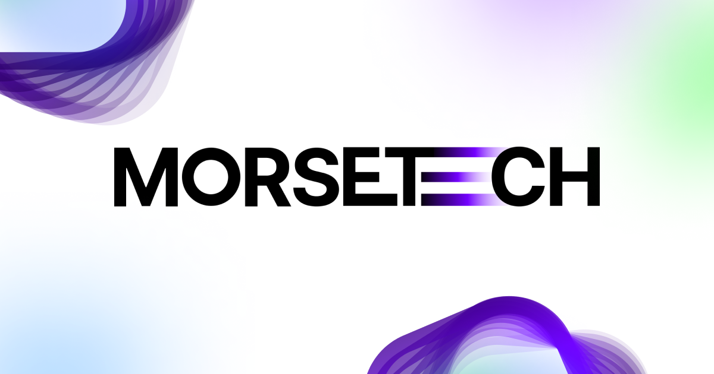

# 🖐 Hi, I’m Morse  

I’m deeply passionate about **Computer Vision** — from classical **Machine Learning** and **Stereo Vision** to modern **Deep Learning** and **Vision Transformers**.  
Currently on a lifelong journey of learning and building real-world AI systems.

My interest in CV started during my Master's thesis, where I explored:

> 🥬 [Fresh Weight Estimation of Lettuce Using 3D Stereoscopic Technique](https://ieeexplore.ieee.org/document/10147436)  
> Presented at the **2023 8th International Conference on Business and Industrial Research (ICBIR)**

This project introduced me to **Stereo Vision**, **Cross-Correlation**, and **Linear Regression**, which became the foundation of my AI journey.

--- 

Follow my work on:

Socials:

You can reach me at:

  

